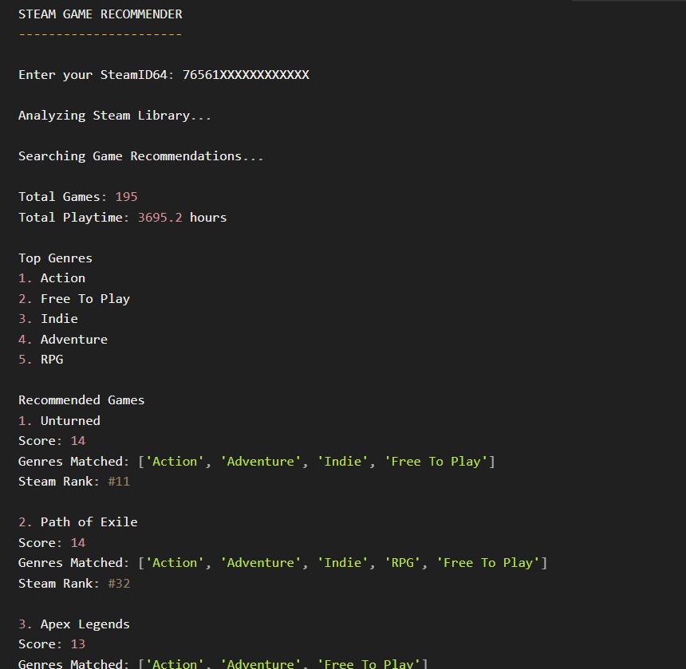

# Steam Game Recommender (Python)
## Description

A terminal-based Steam game recommendation tool written in Python.

The program analyzes a user's Steam library using the Steam Web API, identifies their most played genres, and recommends new games based on current popular titles on Steam.

This project was built as a learning project to practice working with APIs, JSON data, and Python data processing.

---

## Features

* Fetch a user's Steam library using the Steam Web API
* Retrieve all owned games and their playtime
* Analyze the user's most played genres
* Retrieve the Steam Weekly Top 100 games
* Score and rank games based on user preferences:

              Genre Score
        favorite genre match   +5
        second genre match     +3
        third genre match      +2
        other top 5 genre      +1

             Popularity Score
        rank 1-10    +3
        rank 11-30   +2
        rank 31-60   +1
        rank 61-100  +0

              Diversity Bonus
        If a game matches multiple genres: +1 bonus

                            **Final Score**
        final_score = genre_score + popularity_score + diversity_bonus

* Terminal-based interface
* API data parsing using JSON

---

## Technologies Used

* Python
* Steam Web API
* Requests
* JSON

---

## How It Works

1. The user provides their Steam ID and Steam Web API key.
2. The program sends a request to the Steam API to retrieve the user's game library.
3. Each game is analyzed to determine its genres.
4. The program calculates the user's top genres based on playtime.
5. The Steam Weekly Top 100 games are retrieved.
6. The program recommends games that match the user's favorite genres.

---

## Project Structure
steam-game-recommender/

│

├── images/

│       └── preview.png

│

├── main.py

├── steam_api.py

├── library.py

├── analyzer.py

├── recommender.py

├── utils.py

├── terminal.py

│

├── requirements.txt

├── .gitignore

└── README.md

### Module Responsibilities

**main.py**
Program main execution flow.

**steam_api.py**
Handles all communication with the Steam Web API.

**library.py**
Processes the user's game library and extracts relevant information such as playtime and game IDs.

**analyzer.py**
Analyzes the user's library to determine their most played genres.

**utils.py**
Has functions that filter the user data.

**terminal.py**
Program entry point and interface handler.

**recommender.py**
Matches the user's preferred genres with games from the Steam Weekly Top 100 list and generates recommendations.

---

## Preview

Example output of the program running in the terminal.

---

## Installation

* Clone the repository:

        git clone https://github.com/iangago/steam-game-recommender-python.git

* Install dependencies:

        pip install -r requirements.txt

---

## Configuration

* To run the program you need a Steam Web API key.

* Create a file named config.py:

        API_KEY = "your_api_key_here"

* You will also need your SteamID64.

---

## Run

* Run the program using:

        python main.py

---

## What I Learned

### While building this project I practiced several important programming concepts:

* Working with REST APIs
* Sending HTTP requests using the requests library
* Parsing and manipulating JSON data
* Designing modular Python programs
* Structuring multi-file Python projects
* Data analysis using dictionaries and lists
* Building terminal-based applications

---

## Future Improvements

* Caching Steam API responses to reduce API calls
* More advanced recommendation scoring
* Genre visualization charts
* Export recommendations to a file
* Web interface using Flask
* User interface improvements

---

## Versions

v1.1
- Scoring-based recommendation system
- Improved ranking algorithm

v1.0
- Basic genre-based recommendations
- Steam API integration

---

## Author

Ian Gago Mendes